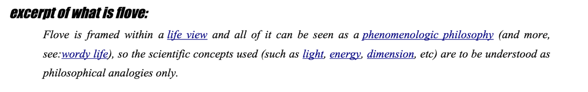

Proyecto vida
=================

Abstract
----------
Un caminante insiste en usar nuestro laboratorio para 
dotar de una cierta energía animación o mero artificio
a su creación Flove.

Flove es una organización de vida. En concreto, aunque
no sería el lugar, la práctica conjuga la representación
del siguiente árbol:

Flove/tree [*].

Funcional
---------------------

Hola, por si me suena la flauta... el reto simple sería:

Aplicar [tu bot](http://aleph1888.github.io/D3js_samples/) para que al clickar 
cada elemento de la tabla wow.wiki.yt/en/life:

- [ ] Se muestre su definición, que se forma automáticamente 
en base a sus semanticas vecinas. por ejemplo:  *Want is the expression of passion,
 comes from feel, goes to love, has zeal as shade, is first child of guess, is parent
 of communication and grandparent of being*.
- [ ] Molaría que cada palabreja en la definición tambien tuviera su link a su propia definición.
- [ ] Molaría tb que se visualizara algo visual y gradual (zoomeado?) el ir desde la tabla al concepto y back.
- [ ] El útlimo molaría sería que los elementos de la tabla fueran expansibles-colapsibles.

Ya no te digo mas molaría, que si no te asusto ;)

Si no tú y sabes de alguien que pudiera interesarle dime, tampoco kiero pagar más de
 10$/hora y prefiero trocar con mis riquezas materiales tb, pero esto ya es jeje.

Técnica
------------------------

El árbol.

P.D.: A ver cuándo nos vemos ¡algún día! internetfreedomfestival.org, hacka la terra? hacklab en barcelona para abril? 
junio-julio en residencia.compartiva.net/caflove o residencia.compartiva.net/ca-flove.

P.D.': He movido todo supervitalismo incluído el libro a vitalismo.org; y sigo dándolo todo, 
pero aun me queda un cacho para que la cosa no de mucho mareo.. :)

Notas
----------
Flove/tree : ver [Flove.odp](https://notabug.org/aleph/FloveApp/src/master/showsplash/flove.odp).
