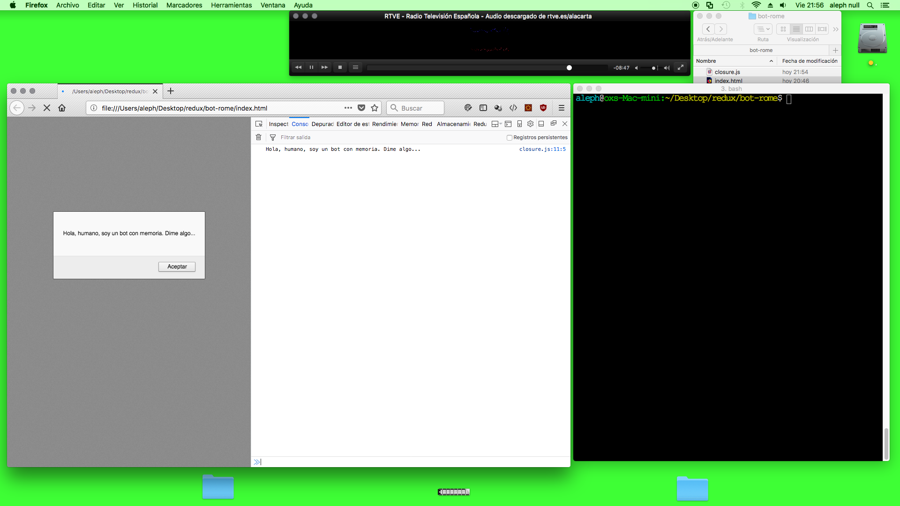
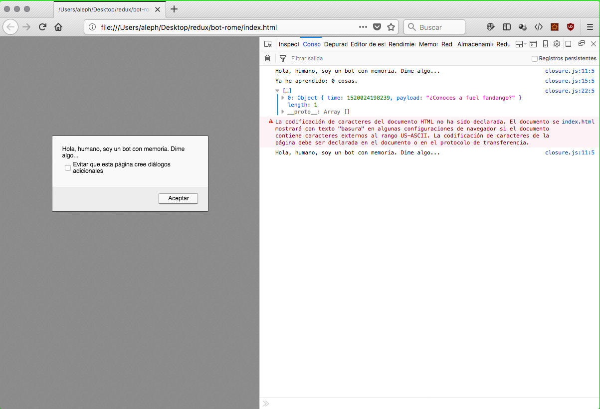
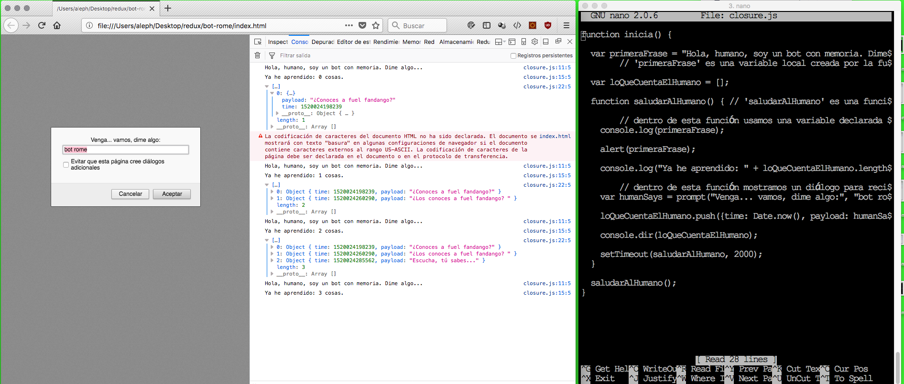

Bot Rome
===============

What?
---------
Simple ping-pong chain recorder on javascript and browser window.

How to run?
------------
http://index.html

Logic for developers?
------------
Just load the [./closure](./closure.js) from .html, like [./index.html]/./index.html) by...

```javascript
inicia();
```

It will trigger window.alert/promp flow on UI and console.log/dir on dev tools console.


Sample
----------




